# Viva Guide: Complete Results and Graph Explanations

This file is a viva-focused walkthrough of the evaluation plots in `results/`.  
It is written to help you answer:
- what each graph means,
- why you plotted it,
- what conclusion to draw,
- what likely viva questions can come and how to answer them.

---

## How to Read This Document

For each graph:
1. **What it represents** (technical meaning),
2. **Why we included it** (research justification),
3. **What to say in viva** (short oral explanation),
4. **Likely questions + answers**.

---

## 0) Snapshot Metrics (From `results/eval_summary.txt`)

Your latest summary:
- **Static:** Reward 6.944, Revenue 2,000,000, Fairness 0.197, Scalper 0.802, Avg Price 1000.0
- **Rule-Based:** Reward 4.538, Revenue 2,459,451.7, Fairness 0.119, Scalper 0.881, Avg Price 1288.0
- **DQN:** Reward 23.567, Revenue 1,569,313.4, Fairness 0.562, Scalper 0.438, Avg Price 669.3
- **PPO:** Reward 12.689, Revenue 1,546,130.7, Fairness 0.435, Scalper 0.565, Avg Price 722.6

**Core message for viva:**  
Baselines can maximize short-term revenue but fail fairness and anti-scalping. RL policies (especially DQN) achieve better multi-objective balance.

---

## 1) `results/comparison_bar_chart.png`

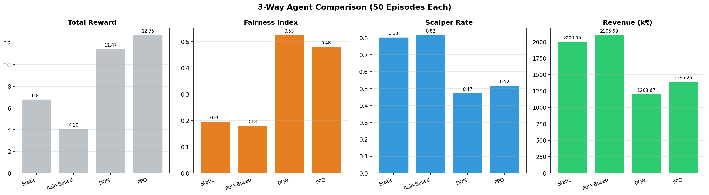

### What it represents
This is the high-level outcome comparison across all methods using the key KPIs:
- total reward,
- fairness index,
- scalper rate,
- revenue.

### Why we included it
Because one graph should summarize the final decision quality. In viva, examiners first ask:  
“Which model is best and why?”  
This graph answers that directly.

### What to say in viva
- If objective were only revenue, rule-based looks strong.
- But our objective is multi-objective: fairness + anti-scalping + user economics + revenue.
- DQN has the highest total reward and much better fairness/scalper control.
- PPO is also better than static/rule-based on fairness/scalper trade-off.

### Likely viva questions
**Q: Why is DQN revenue lower than rule-based? Is that bad?**  
A: Not necessarily. Rule-based allows aggressive scalper capture and higher prices. DQN sacrifices some raw revenue to improve fairness and suppress scalping, which is exactly the system goal.

**Q: Then why not always choose rule-based if company wants money?**  
A: Scalper-heavy allocation damages trust, fan access, and long-term platform health. Our reward formulation encodes that business reality.

---

## 2) `results/dqn_action_heatmap.png`

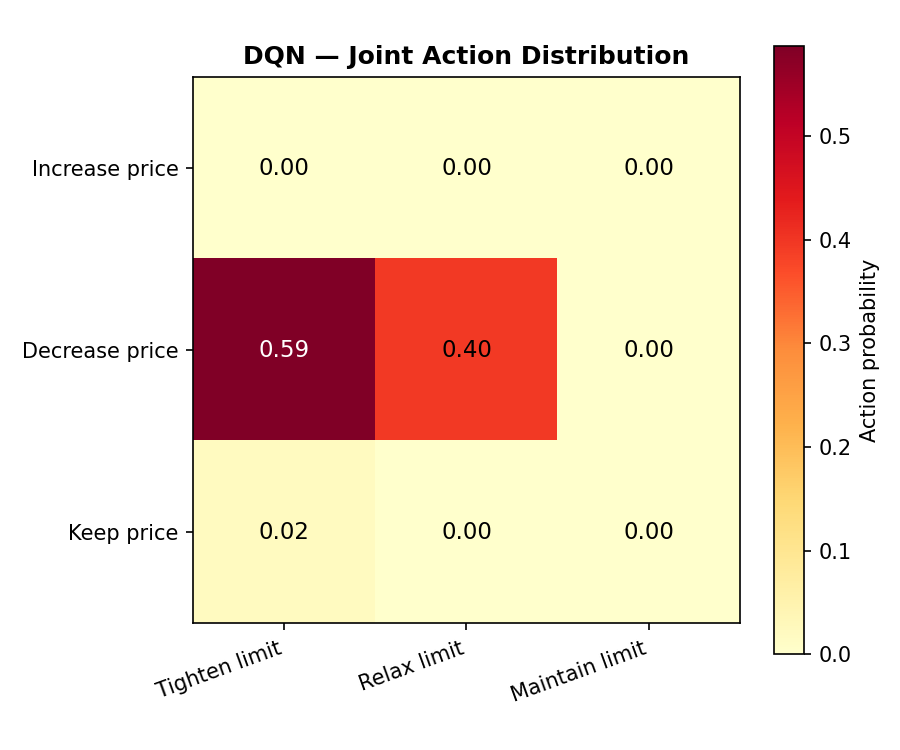

### What it represents
A 3x3 distribution of DQN joint actions:
- rows: price move (increase/decrease/keep),
- columns: purchase-limit move (tighten/relax/maintain).

Each cell shows how often that joint decision is used.

### Why we included it
To prove the model learns **policy structure**, not just a scalar score.  
Without this, examiner can ask: “How do you know policy is meaningful?”

### What to say in viva
- DQN is selective: it concentrates on a subset of actions.
- This indicates state-dependent strategic behavior (especially during suspicious demand phases).
- In practical terms: model learns when to tighten limits and when to move price.

### Likely viva questions
**Q: Why discrete 9 actions instead of continuous control?**  
A: Discrete actions simplify learning and interpretability for early-stage research. It also mirrors realistic operational decisions (“increase/decrease/hold”).

**Q: Why not just control price and keep limit fixed?**  
A: Price alone cannot stop bots that can still buy in volume. Limit control directly restricts bulk bot acquisition.

---

## 3) `results/ppo_action_heatmap.png`

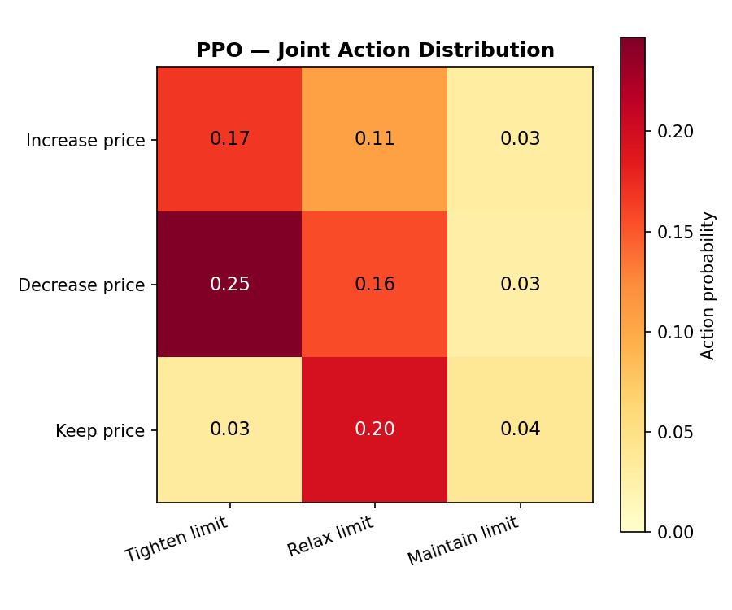

### What it represents
Same action-space visualization for PPO.

### Why we included it
To compare policy behavior style between value-based (DQN) and policy-gradient (PPO) learners.

### What to say in viva
- PPO typically shows a smoother spread across actions.
- DQN tends to be sharper/more concentrated.
- Both still indicate adaptive joint control, not static decisioning.

### Likely viva questions
**Q: Why does PPO look less concentrated than DQN?**  
A: PPO optimizes stochastic policy updates with clipped objective; this often preserves broader action usage, especially in uncertain regions.

---

## 4) `results/d3qn_training_dashboard.png`

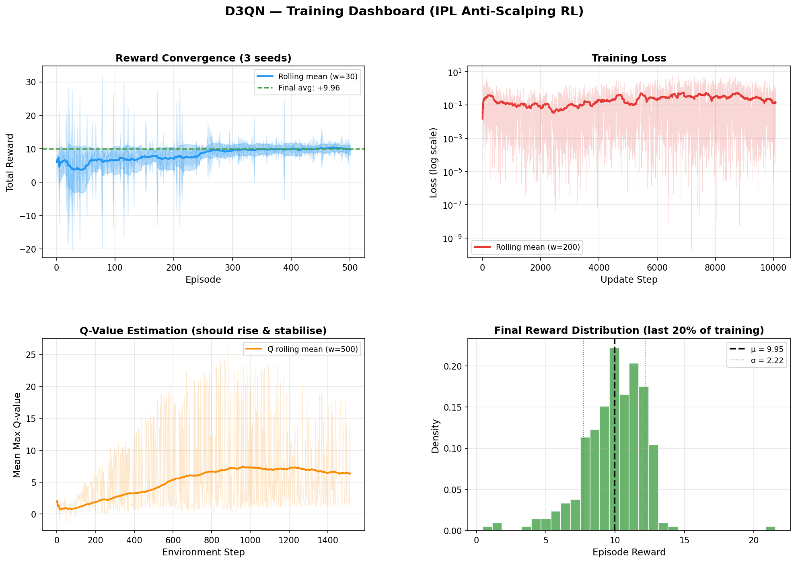

### What it represents
Multi-panel D3QN training diagnostics (reward trends, loss behavior, and stability indicators).

### Why we included it
Examiners often ask: “Did the model actually converge, or are you showing lucky endpoints?”

### What to say in viva
- Early phase: noisy exploration.
- Middle phase: reward improves as replay buffer quality increases.
- Later phase: smoother trajectories indicate policy stabilization.

### Likely viva questions
**Q: What signs indicate convergence in RL?**  
A: Reward trend stabilization, reduced high-variance oscillation, and stable loss/Q behavior over long windows.

---

## 5) `results/rainbow_dqn_training_dashboard.png`

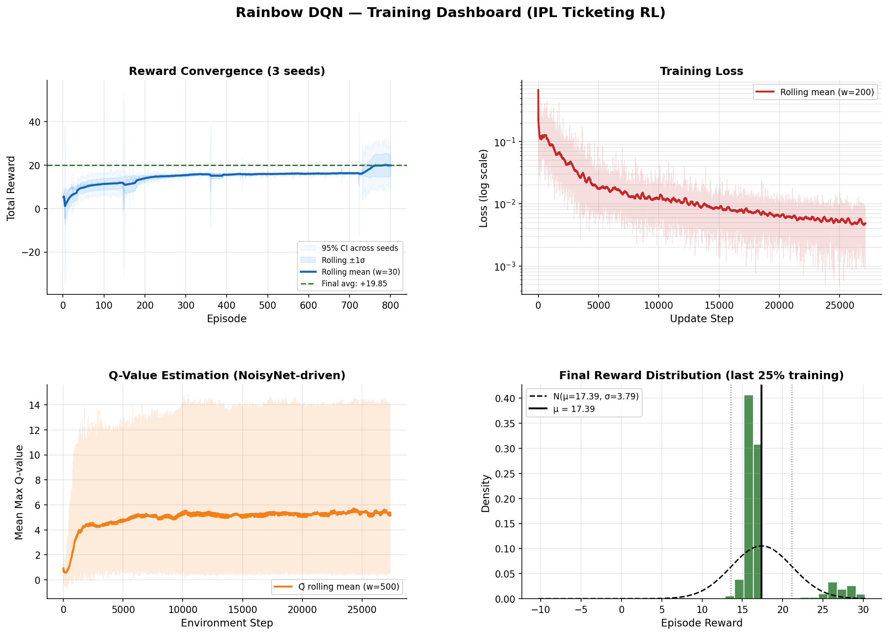

### What it represents
Training dashboard for Rainbow-style DQN variant (dueling + double + PER + n-step + noisy nets).

### Why we included it
To justify architecture choice and show that advanced DQN components provide learning robustness.

### What to say in viva
- Rainbow components reduce known DQN weaknesses:
  - overestimation bias (Double Q),
  - inefficient replay sampling (PER),
  - sparse credit assignment (n-step),
  - unstable value separation (Dueling),
  - weak exploration (Noisy layers).
- This is why DQN performs best in current experiments.

### Likely viva questions
**Q: Why Rainbow and not vanilla DQN?**  
A: Vanilla DQN was less stable and less sample-efficient in this environment; Rainbow gives stronger and more reliable convergence.

---

## 6) `results/dqn_training_curves.png`

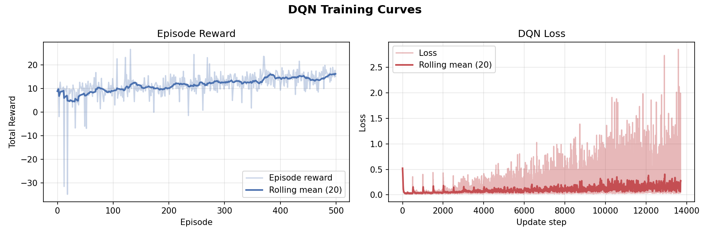

### What it represents
Episode-level DQN learning progression (typically reward/revenue evolution).

### Why we included it
To provide a simpler, cleaner view than dashboards for quick performance storytelling.

### What to say in viva
- Initial oscillation is expected due to exploration.
- Trend improves and plateaus at better operating region.
- Plateau is desirable: indicates stable policy, not uncontrolled drift.

### Likely viva questions
**Q: Why not train longer if still improving slightly?**  
A: Diminishing returns after plateau. We target practical convergence and repeatability, not infinite training.

---

## 7) `results/ppo_training_dashboard.png`

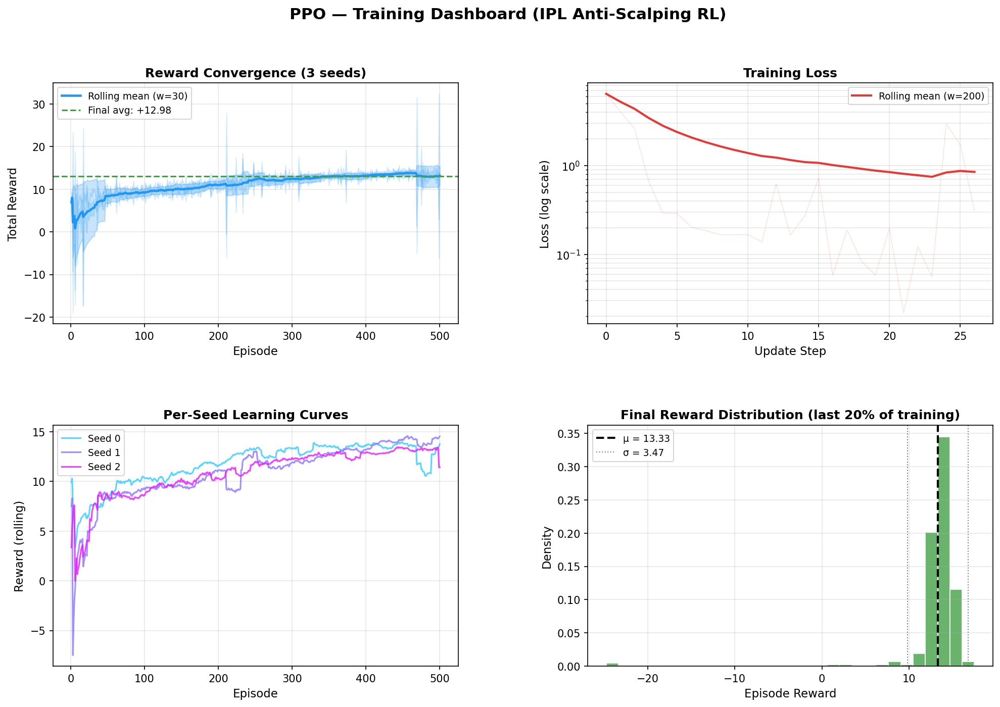

### What it represents
Recurrent PPO diagnostics (policy/value updates, stability, and reward movement).

### Why we included it
To show that on-policy methods were also explored and validated, not only Q-learning.

### What to say in viva
- PPO uses clipped objective for stable policy updates.
- Training is usually smoother but may require more samples than off-policy DQN.
- In this setup PPO is competitive but below DQN on final scalarized objective.

### Likely viva questions
**Q: Why does PPO underperform DQN here?**  
A: Environment/action structure and reward scaling favor off-policy replay efficiency; DQN reuses experience heavily, PPO does not.

---

## 8) `results/r_ppo_training_dashboard.png`

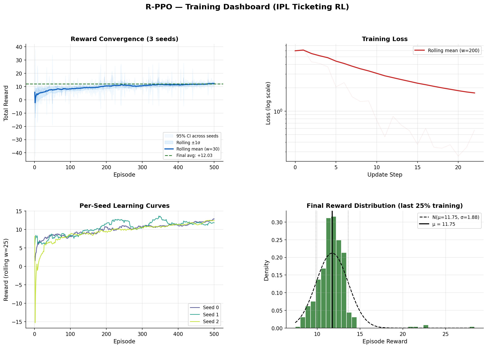

### What it represents
Dashboard emphasizing recurrent (LSTM-based) PPO behavior across temporal phases.

### Why we included it
Ticket sales are phase-driven (launch rush, mid-sale, closing). Recurrent memory can capture temporal dependencies.

### What to say in viva
- LSTM helps track context across timesteps (recent suspicion/price dynamics).
- This supports better phase-aware control compared to purely memoryless policies.

### Likely viva questions
**Q: Do we really need recurrence if state already has time?**  
A: Time index alone is not enough for short-term trajectory history (recent shocks, momentum); recurrence can encode this temporal context.

---

## 9) `results/ppo_training_curves.png`

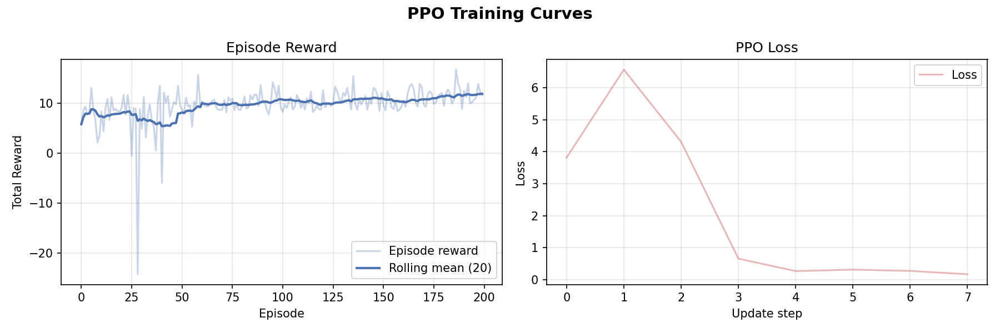

### What it represents
PPO episode progression in a compact plot.

### Why we included it
For one-to-one visual comparison with `dqn_training_curves.png`.

### What to say in viva
- PPO steadily improves from random/weak policy baseline.
- Final performance remains lower than DQN but still clearly above static baseline on fairness/scalper outcomes.

### Likely viva questions
**Q: Then why keep PPO in project?**  
A: It validates method robustness across algorithm families and strengthens scientific comparison.

---

## 10) `results/hyperparameter_analysis.png`

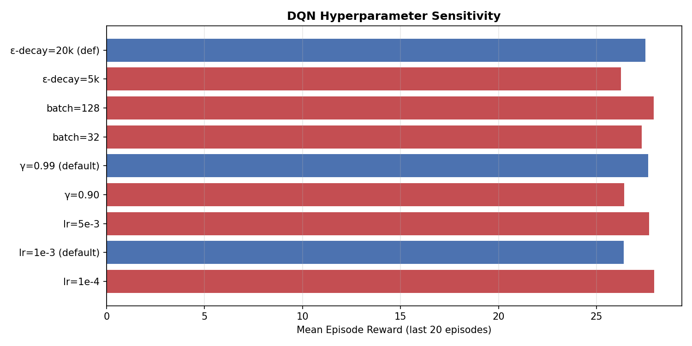

### What it represents
Sensitivity of performance to hyperparameters (learning rate, gamma, batch size, etc.).

### Why we included it
To show the model was tuned scientifically and not cherry-picked from a single random run.

### What to say in viva
- Hyperparameters significantly change final reward.
- Chosen defaults are based on comparative evidence.
- This analysis supports reproducibility and engineering rigor.

### Likely viva questions
**Q: Which hyperparameter mattered most?**  
A: Typically learning rate and discount factor had strong effects; too high LR destabilizes, too low slows learning.

---

## 11) `results/matchday_analytics_dqn.png`

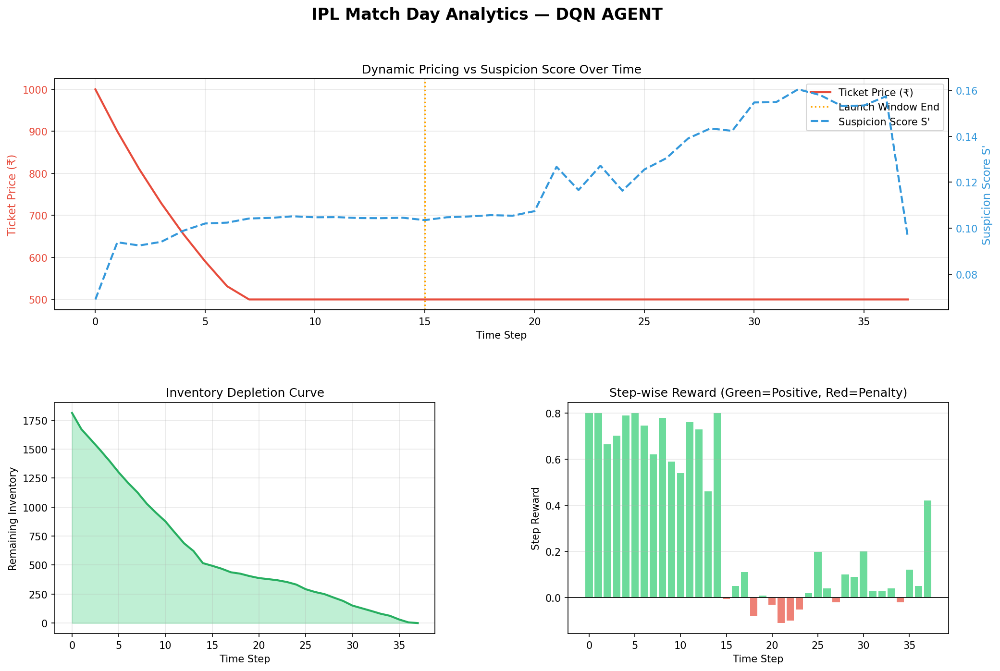

### What it represents
Time-series narrative for one full match-day simulation under DQN:
- price trajectory,
- suspicion trend,
- inventory depletion,
- step-wise reward.

### Why we included it
To make policy behavior explainable step-by-step (important in viva and deployment discussions).

### What to say in viva
- In launch spikes, policy often tightens limits to block bulk bot capture.
- During lower demand phases, actions stabilize for controlled sales.
- Near ending, policy balances sell-through with fairness/risk.

### Likely viva questions
**Q: Is this just overfitting to one episode?**  
A: No. This is qualitative illustration; quantitative claims are from multi-episode evaluation in `evaluate.py`.

---

## 12) `results/matchday_analytics_ppo.png`

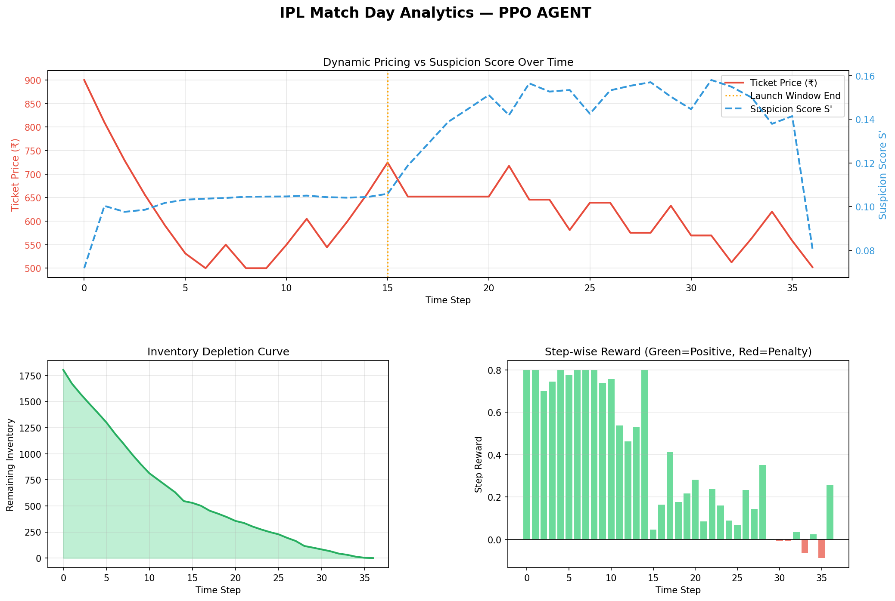

### What it represents
Same match-day narrative for PPO.

### Why we included it
To compare dynamic control style between RL methods in a human-readable way.

### What to say in viva
- PPO also adapts over phases, typically with smoother transitions.
- It demonstrates consistency of the RL idea beyond one algorithm.

### Likely viva questions
**Q: Why are DQN and PPO trajectories different?**  
A: Different optimization principles (value-based off-policy vs policy-gradient on-policy) produce different control styles.

---

## 13) `results/matchday_analytics_static.png`

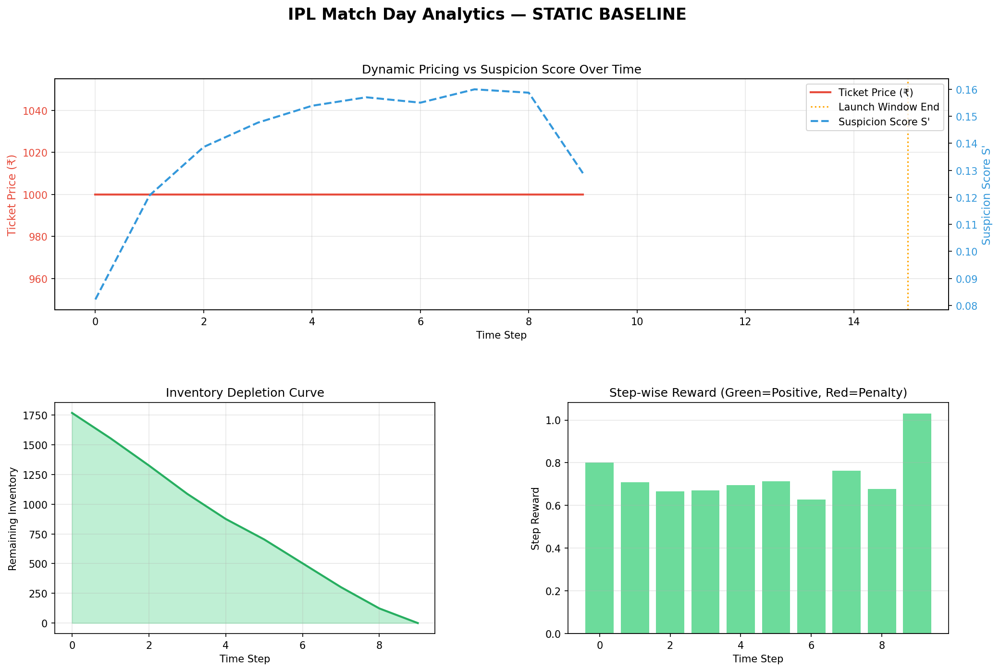

### What it represents
Match-day trajectory under fixed static policy.

### Why we included it
To establish baseline failure mode visually.

### What to say in viva
- No adaptation to suspicion surges.
- Inventory can clear fast with high scalper dominance.
- This validates why static ticketing controls are insufficient.

### Likely viva questions
**Q: But static is simple and reliable, why replace it?**  
A: Reliability is high, but policy objective is poor in adversarial conditions (low fairness, high scalper capture).

---

## 14) `results/matchday_analytics_rule_based.png`

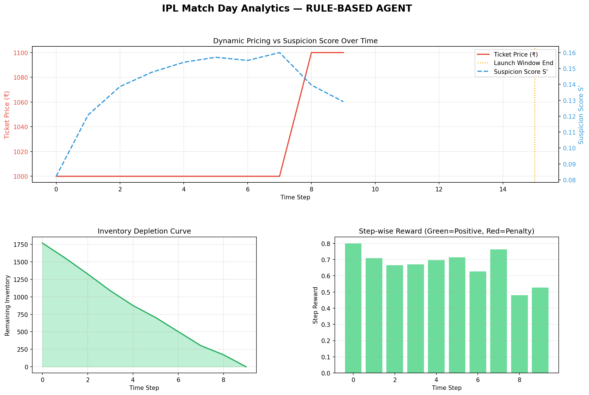

### What it represents
Trajectory for threshold/rule controller.

### Why we included it
To compare against a stronger non-RL baseline (not just static).

### What to say in viva
- Rule-based reacts, but only with fixed heuristics.
- It cannot optimize long-horizon trade-offs like RL.
- Often overemphasizes revenue/price response and underperforms fairness.

### Likely viva questions
**Q: Why not just improve rules instead of RL?**  
A: Rules become brittle and hard to scale with scenario complexity. RL learns from interaction and adapts jointly over multiple conflicting objectives.

---

## Model Choice: Why DQN and PPO Specifically?

Use this if examiner asks “Why these models?”

- **DQN family**: strong for discrete action spaces; sample-efficient due to replay; good when action space is small but strategic.
- **PPO**: stable policy optimization baseline; widely accepted; easy to compare and justify in academic settings.
- **Using both** strengthens credibility: result is not tied to one algorithm.

---

## Typical Viva Cross-Questions (Quick Answers)

**Q: Is this real IPL data?**  
A: No, this is a research simulation environment calibrated for adversarial ticketing behavior.

**Q: Why include suspicion score in state?**  
A: It gives direct behavioral risk signal so policy can proactively tighten controls.

**Q: Could reward weights bias conclusions?**  
A: Yes, scalarization reflects platform priorities. We discuss this and provide sensitivity analyses.

**Q: Deployment challenges?**  
A: Need real data calibration, legal constraints, anti-bot infrastructure integration, and fairness governance.

---

## Final 30-Second Conclusion for Viva

These graphs collectively show that RL-based joint control of price and purchase limits is superior to static and rule-only methods for adversarial ticketing. DQN performs best on the current multi-objective formulation, PPO remains competitive, and both significantly improve fairness and reduce scalper capture while maintaining practical revenue.

